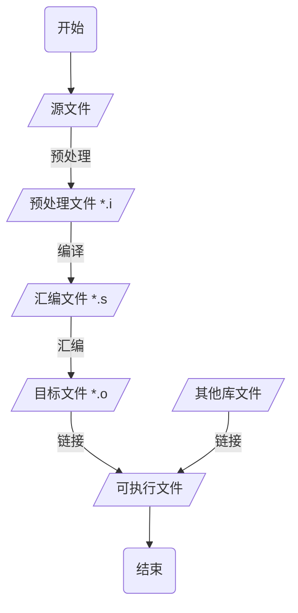

<!--
 * @Description: 
 * @Version: 1.0
 * @Author: DaLao
 * @Email: dalao@xxx.com
 * @Date: 2021-06-15 15:31:05
 * @LastEditors: Li Yuanhao
 * @LastEditTime: 2023-02-09 20:44:25
-->

# C/C++ 编译

```c++
// main.c
#include <stdio.h>

int main(void) {
    printf("Hello World\n");
    return 0;
}
```

一步编译命令

```sh
gcc main.c -o main
```

| 参数 | 含义           |
| ---- | -------------- |
| I    | 指定头文件目录 |
| o    | 指定输出文件名 |


## 总流程




## 预处理(Preprocessing)

预处理器`cpp`将源文件中所有**引用的头文件**以及**宏定义**替换成真正的内容,

生成预处理文件, 后缀为.i

#### 规则

- 删除所有#define删除, 展开所有宏定义

- 处理所有条件编译命令, 如 `#if`、`#ifdef`、`#elif`、`#else`、#`endif` 等

- 处理`#include`命令, 将被包含文件的内容插入到该命令所在的位置, 与复制粘贴的效果一样

    此过程递归进行, 也就是被包含的文件可能还会包含其他的文件

- 删除所有的注释 // 和 /* ... */

- 添加行号和文件名标识, 便于在调试和出错时给出具体的代码位置

- 保留所有编译器需要使用的`#pragma`命令


#### 单步指令

- \-E

> 编译器在预处理之后退出, 不进行后续编译过程

例如, 预处理器会读C库中stdio.h的内容并插入到main.c中, 生成新文件main.i

```c
gcc -E main.c -o main.i
```


经过预处理之后代码体积会大很多


#### include规则

- #include <>

在编译器设置的include路径内搜索

如果是在命令行中编译, 则在系统的INCLUDE环境变量内搜索


- #include ""

在包含当前include指令文件所在的文件夹内搜索

如果已经有多个被include的文件, 则按照它们被打开的相反顺序去搜索

如果上一步找不到, 则在之前已经使用include指令打开过的文件所在的文件夹内搜索

如果上一步找不到, 则在编译器设置的include路径内搜索

如果上一步找不到, 则在系统的INCLUDE环境变量内搜索


### 编译(Compilation)


编译器`ccl`将预处理完的.i文件进行系列词法分析、语法分析、语义分析以及优化后生成相应的汇编文件, 后缀为.s


#### 单步指令

\-S

> Compile only; do not assemble or link.


```c
gcc -S main.c -o main.s
```

其中的main作为一个函数给出了机器语言的输出指令

```c
    .file    "main.c"
    .section    .rodata
.LC0:
    .string    "hello, world"
    .text
    .globl    main
    .type    main, @function
main:
.LFB0:
    .cfi_startproc
    pushq    %rbp
    .cfi_def_cfa_offset 16
    .cfi_offset 6, -16
    movq    %rsp, %rbp
    .cfi_def_cfa_register 6
    movl    $.LC0, %edi
    call    puts
    movl    $0, %eax
    popq    %rbp
    .cfi_def_cfa 7, 8
    ret
    .cfi_endproc
.LFE0:
    .size    main, .-main
    .ident    "GCC: (GNU) 4.8.5 20150623 (Red Hat 4.8.5-44)"
    .section    .note.GNU-stack, "", @progbits
```


### 汇编(Assemble)

汇编器as将汇编代码转换为为机器语言, 保存为二进制**目标文件**, 后缀.o

#### 单步参数

- \-c

> Compile and assemble, but do not link.


```sh
# 有源文件生成目标文件
gcc -c main.c -o main.o

# 由汇编文件生成目标文件 
gcc -c main.s -o main.o
```


### 链接(Linking)


链接器ld将多个目标文件以及所需的库文件(如.so)组织成**可执行文件**(executable file)

#### 单步参数

- \-o \<file>

> Place the output into \<file>


```c
g++ -o main.o main
```


#### 静态链接

函数的代码将从其所在静态链接库中被拷贝到最终的可执行程序中

该程序被执行时这些代码将被装入到该进程的虚拟地址空间中

静态链接库实际上是一个目标文件的集合, 其中的每个文件含有库中的一个或者一组相关函数的代码


#### 动态链接

函数的代码被放到称作是动态链接库或共享对象的某个目标文件中

链接程序此时所作的只是在最终的可执行程序中记录下共享对象的名字以及其它少量的登记信息

在此可执行文件被执行时, 动态链接库的全部内容将被映射到运行时相应进程的虚地址空间

动态链接程序将根据可执行程序中记录的信息找到相应的函数代码