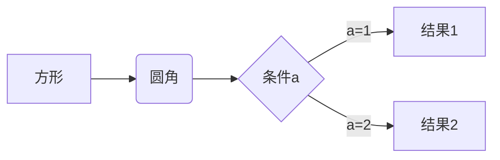
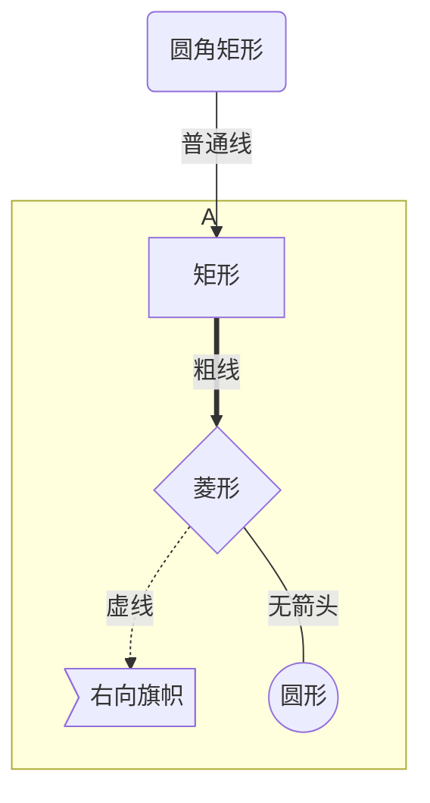

<!--
 * @Description: 
 * @Version: 1.0
 * @Author: DaLao
 * @Email: dalao_li@163.com
 * @Date: 2021-10-13 19:58:18
 * @LastEditors: dalao
 * @LastEditTime: 2022-04-03 20:41:07
-->

## 图形


代码块标签`mermaid`


### 方向

| 方向     | 代码 |
| -------- | ---- |
| 从上到下 | TB   |
| 从下到上 | BT   |
| 从左到右 | LR   |
| 从右到左 | RL   |


### 形状

节点图像由节点ID，描述文字组成
```
graph TB
    A[方形]
    B(圆角形)
    C((圆形))
    D>旗形]
    E{菱形}
```


### 连接

| 指令                        | 连接方式         |
| --------------------------- | ---------------- |
| A --> B<br>A -- 描述 --> B  | A箭头指向B       |
| A -- B<br>A -- 描述 -- B    | A不带箭头指向B   |
| A -.- B<br>A -. 描述 .- B   | A虚线指向B       |
| A -.-> B<br>A -. 描述 .-> B | A带箭头虚线指向B |
| A ==> B<br>A == 描述 ==> B  | A加粗箭头指向B   |


### 流程图

```
graph LR
A[方形] -->B(圆角)
    B --> C{条件a}
    C -->|a=1| D[结果1]
    C -->|a=2| E[结果2]
```




### 子图

```
graph TB
  id1(圆角矩形)--普通线-->id2[矩形];
  subgraph A
   id2==粗线==>id3{菱形}
   id3-.虚线.->id4>右向旗帜]
   id3--无箭头---id5((圆形))
  end
```

