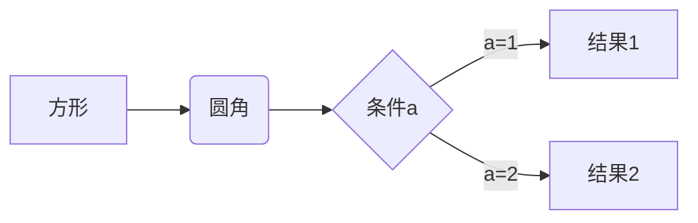
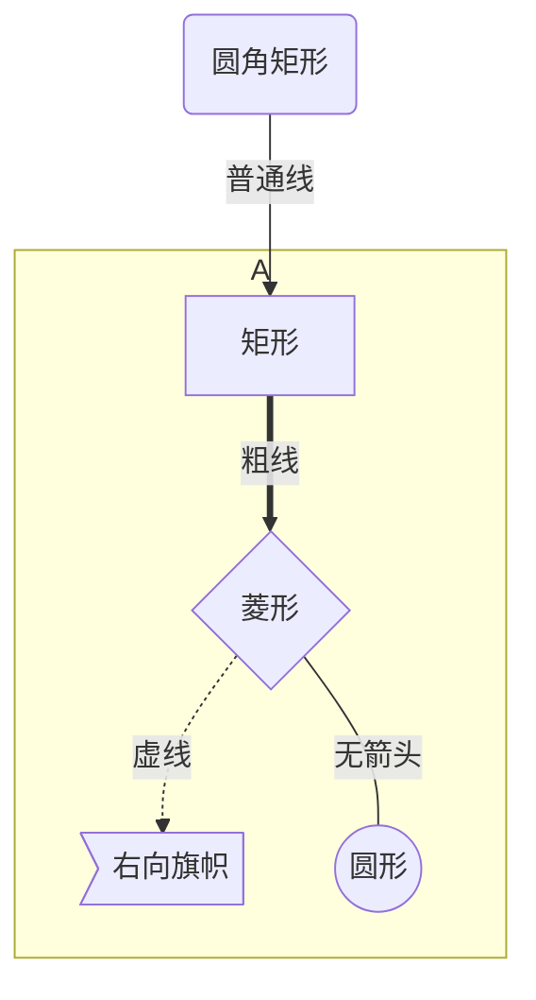

<!--
 * @Description: 
 * @Version: 1.0
 * @Author: DaLao
 * @Email: dalao_li@163.com
 * @Date: 2021-10-13 20:53:40
 * @LastEditors: DaLao
 * @LastEditTime: 2021-10-13 21:10:48
-->

## 流程图

```
graph LR
A[方形] -->B(圆角)
    B --> C{条件a}
    C -->|a=1| D[结果1]
    C -->|a=2| E[结果2]
```



## 子图

```
graph TB
  id1(圆角矩形)--普通线-->id2[矩形];
  subgraph A
   id2==粗线==>id3{菱形}
   id3-.虚线.->id4>右向旗帜]
   id3--无箭头---id5((圆形))
  end
```

