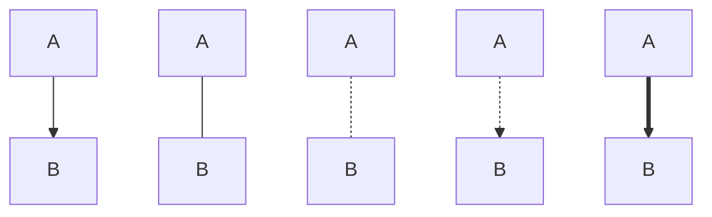
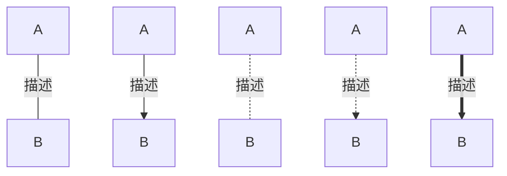
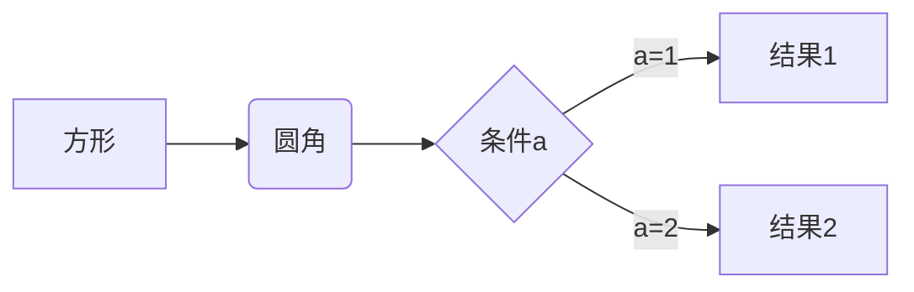
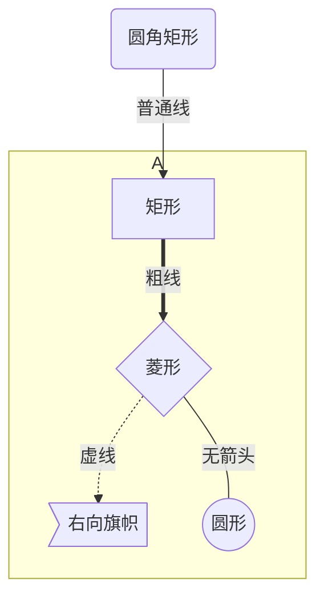

<!--
 * @Description: 
 * @Version: 1.0
 * @Author: DaLao
 * @Email: dalao_li@163.com
 * @Date: 2021-11-16 23:39:26
 * @LastEditors: DaLao
 * @LastEditTime: 2022-07-01 22:37:11
-->

## Markdown

### 1 数学


- 参考

[https://www.jianshu.com/p/25f0139637b7](https://www.jianshu.com/p/25f0139637b7)


#### 1.1 颜色


$\color{blue}{text}$

```sh
$\color{blue}{text}$
```


#### 1.2 上下标


$x_1$

```sh
$x_1$
```

$x^2$

```sh
$x^2$
```

$x_i^2$

```sh
$x_i^2$
```


#### 1.3 大括号


$\overbrace{b+c+d}^m$

```sh
$\overbrace{b+c+d}^m$
```

$\underbrace{c+d+e}_n$

```sh
$\underbrace{c+d+e}_n$
```


#### 1.4 分数


$\frac {a+c+1}{b+c+2}$

```sh
$\frac {a+c+1}{b+c+2}$
```


$\frac{a}{b}$

```sh
$\frac{a}{b}$
```


#### 1.5 公式


- 行内公式

$\Gamma(z) = \int_0^\infty t^{z-1}e^{-t}dt\,.$

```sh
$\Gamma(z) = \int_0^\infty t^{z-1}e^{-t}dt\,.$
```


- 行间公式

$$\Gamma(z) = \int_0^\infty t^{z-1}e^{-t}dt\,.$$

```sh
$$\Gamma(z) = \int_0^\infty t^{z-1}e^{-t}dt\,.$$
```


- 多行公式

$$
L(Y,f(X)) =
\begin{cases}
0,& \text{Y = f(X)} \\[5ex]
1,& \text{Y $\neq$ f(X)}
\end{cases}
$$

```sh
$$
L(Y,f(X)) =
\begin{cases}
0, & \text{Y = f(X)} \\[5ex]
1, & \text{Y $\neq$ f(X)}
\end{cases}
$$
```


#### 1.6 表格


使用\begin{array}{列样式}…\end{array},创建表格,列样式可以是clr 表示居中,左,右对齐,还可以使用| 表示一条竖线

表格中各行使用\\ 分隔,各列使用& 分隔,使用\hline 在本行前加入一条直线


$$
\begin{array}{c|lcr}
n & \text{Left} & \text{Center} & \text{Right} \\
\hline
1 & 0.24 & 1 & 125 \\
2 & -1 & 189 & -8 \\
3 & -20 & 2000 & 1+10i \\
\end{array}
$$

```sh
$$
\begin{array}{c|lcr}
n & \text{Left} & \text{Center} & \text{Right} \\
\hline
1 & 0.24 & 1 & 125 \\
2 & -1 & 189 & -8 \\
3 & -20 & 2000 & 1+10i \\
\end{array}
$$
```


### 图形


代码块标签`mermaid`


- 方向

| 方向     | 代码 |
| -------- | ---- |
| 从上到下 | TB   |
| 从下到上 | BT   |
| 从左到右 | LR   |
| 从右到左 | RL   |


#### 形状


节点图像由节点ID,描述文字组成


```
graph TB
    A[方形]
    B(圆角形)
    C((圆形))
    D>旗形]
    E{菱形}
```


#### 连接


| 指令                        | 连接方式         |
| --------------------------- | ---------------- |
| A --> B<br>A -- 描述 --> B  | A箭头指向B       |
| A -- B<br>A -- 描述 -- B    | A不带箭头指向B   |
| A -.- B<br>A -. 描述 .- B   | A虚线指向B       |
| A -.-> B<br>A -. 描述 .-> B | A带箭头虚线指向B |
| A ==> B<br>A == 描述 ==> B  | A加粗箭头指向B   |





#### 流程图





```
graph LR
A[方形] -->B(圆角)
    B --> C{条件a}
    C -->|a=1| D[结果1]
    C -->|a=2| E[结果2]
```


#### 子图




```
graph TB
  id1(圆角矩形)--普通线-->id2[矩形];
  subgraph A
   id2==粗线==>id3{菱形}
   id3-.虚线.->id4>右向旗帜]
   id3--无箭头---id5((圆形))
  end
```


### 图片


#### 本地图片


若网络发布则不推荐

```sh

```


#### Base64格式


base64编码长,影响文档排版
```sh
![图片名,可选][Base64_ID]

...
[Babse64_ID]:data:image/png;base64.....
```


#### 图床


需在有网络条件下浏览

```sh

```